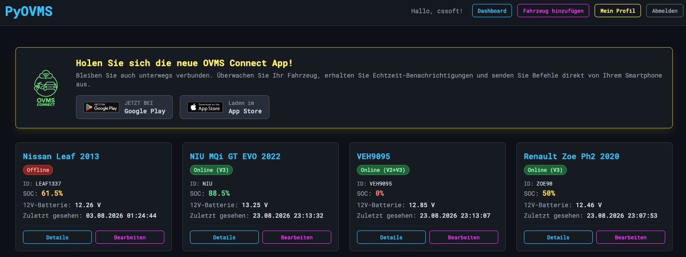
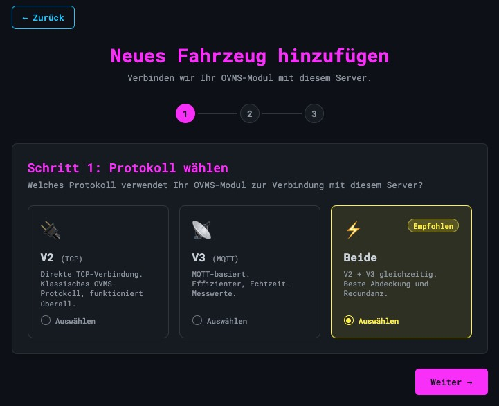
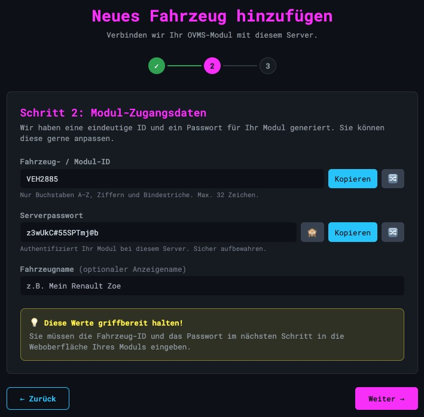
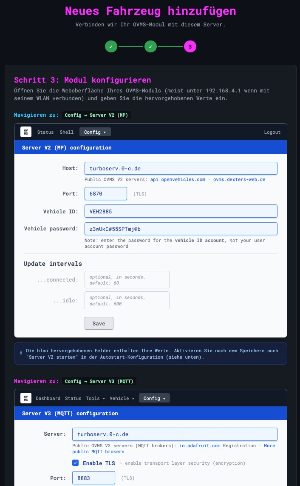

# Adding a Vehicle

← Back to the [Documentation Map](../Readme.md#documentation-map)

Registering an OVMS module with this server takes three steps. The wizard generates the credentials for you and then shows you exactly where to type them into the module's own web interface — mirroring its config screens, with your values highlighted in blue.

Start it from **Add Vehicle** in the header of the dashboard.

---

## The dashboard



The dashboard lists every vehicle you own — administrators see all of them, with an *Owner* column. Each card shows:

- **Connection badge** — `Online (V2)`, `Online (V3)`, `Online (V2+V3)` or `Offline`. Both protocols are tracked separately, so a module using both shows the combined badge.
- **Module ID** — the ID the module authenticates with
- **SOC** — colour-coded, so a low battery stands out across a fleet
- **12V battery voltage** — a slowly falling value here is the usual first sign of trouble
- **Last seen** — timestamp of the most recent message on any protocol

*Details* opens the [vehicle detail page](vehicle.md); *Edit* opens the settings for that vehicle, where the optional services can be toggled later.

---

## Step 1 — Choose the protocol



| Option | What it means |
|---|---|
| **V2 (TCP)** | Direct TCP connection, the classic OVMS protocol. Works with every module and every firmware version. |
| **V3 (MQTT)** | MQTT-based. More efficient, real-time metrics, and the only source for cell statistics and the full metric feed. |
| **Both** *(recommended)* | V2 and V3 at the same time — best coverage and redundancy. If one transport drops, the other keeps reporting. |

V3 needs an MQTT broker configured on this server; if none is set up, the option says so and stays unavailable. See the [MQTT Setup Guide](MQTT_SETUP.md).

Your choice only decides which configuration blocks step 3 shows you — nothing here is locked in permanently.

---

## Step 2 — Module credentials



The server generates a unique module ID and a strong password. Both can be edited or re-rolled with the shuffle button, and each has a copy button.

- **Vehicle / Module ID** — letters A–Z, digits and hyphens only, max 32 characters. This is the identity the module authenticates with, and it appears in every MQTT topic, so pick something you will recognise later.
- **Server password** — authenticates the module against this server. It is **not** your user account password, and it is not the same thing as the module's own admin password. Store it in your password manager.
- **Vehicle name** — an optional display name (`My Renault Zoe`). Purely cosmetic; the ID is what matters technically.

Keep both values in front of you — the next step is typing them into the module.

---

## Step 3 — Configure the module



Open your OVMS module's web interface. If you are connected to the module's own Wi-Fi, that is usually **http://192.168.4.1**.

The wizard reproduces the module's configuration pages with your values already filled in — every blue-highlighted field is something you copy across.

**Config → Server V2 (MP)** — for V2 or Both:

| Field | Value |
|---|---|
| Host | your server's hostname |
| Port | `6870` (TLS) — the `TCP_SSL_PORT` setting; `6867` is the plaintext port |
| Vehicle ID | the ID from step 2 |
| Vehicle password | the server password from step 2 |

The update intervals are optional (60 s connected, 600 s idle by default).

**Config → Server V3 (MQTT)** — for V3 or Both: the broker hostname, *Enable TLS*, port `8883`, and the same ID and password.

**Config → Auto start** — after saving, enable **Start server V2** and/or **Start server V3** there, otherwise the module will not reconnect after a reboot.

**Module CLI helper** — if you prefer the module's shell over its web UI, expand this section for the equivalent `config set` commands, ready to paste:

```
config set auto server.v2 yes
config set server.v2 port 6870
config set server.v2 server <host>
config set server.v2 tls yes
config set password server.v2 <password>

server v2 start
```

The V3 block is generated the same way, including the topic prefix
(`ovms/<username>/<VEHICLEID>/`) that the server subscribes to.

**Additional settings** *(optional, collapsible)*:

- **Vehicle owner** — admins can assign the vehicle to a registered user. Administrator accounts cannot own vehicles themselves.
- **Optional services** — *Enable Trip Tracking* (adds the [Trips and Search & Heatmap tabs](vehicle.md#trips), requires [Karto](CONFIGURATION.md#karto-trip-tracking)) and *Enable Charge Logging* (adds the [Charges tab](vehicle.md#charges)). Both can be switched on later from *Edit Vehicle*.

**Save Vehicle** writes the record and, for V3, syncs the MQTT broker's password and ACL files so the module is allowed to connect immediately.

---

## After saving

The module should connect within a minute or two — if it does not, `wakeup` from the module's own shell, or check the **Security Events** page under *Admin* for rejected authentication attempts.

Notification recipients (ntfy, email, and push from the OVMS Connect app) are configured afterwards on the [Notifications tab](vehicle.md#notifications) of the vehicle detail page.

For fleets, **auto-provisioning** (under *Admin → Auto-Provisioning*) lets a module fetch its own configuration from a named profile instead of being set up by hand.
