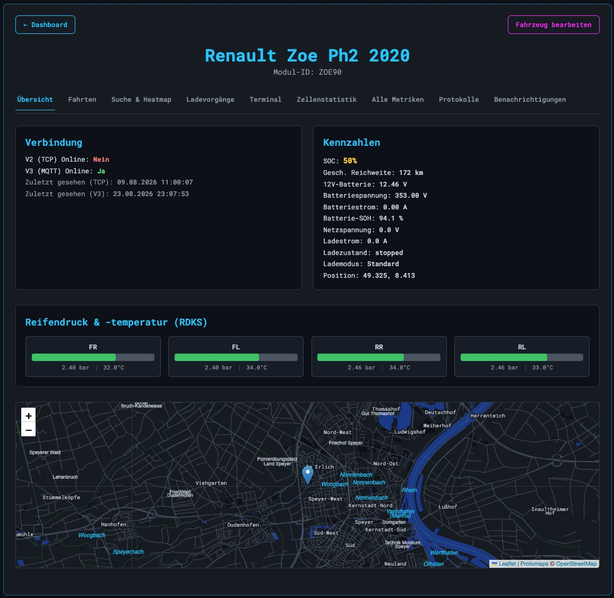
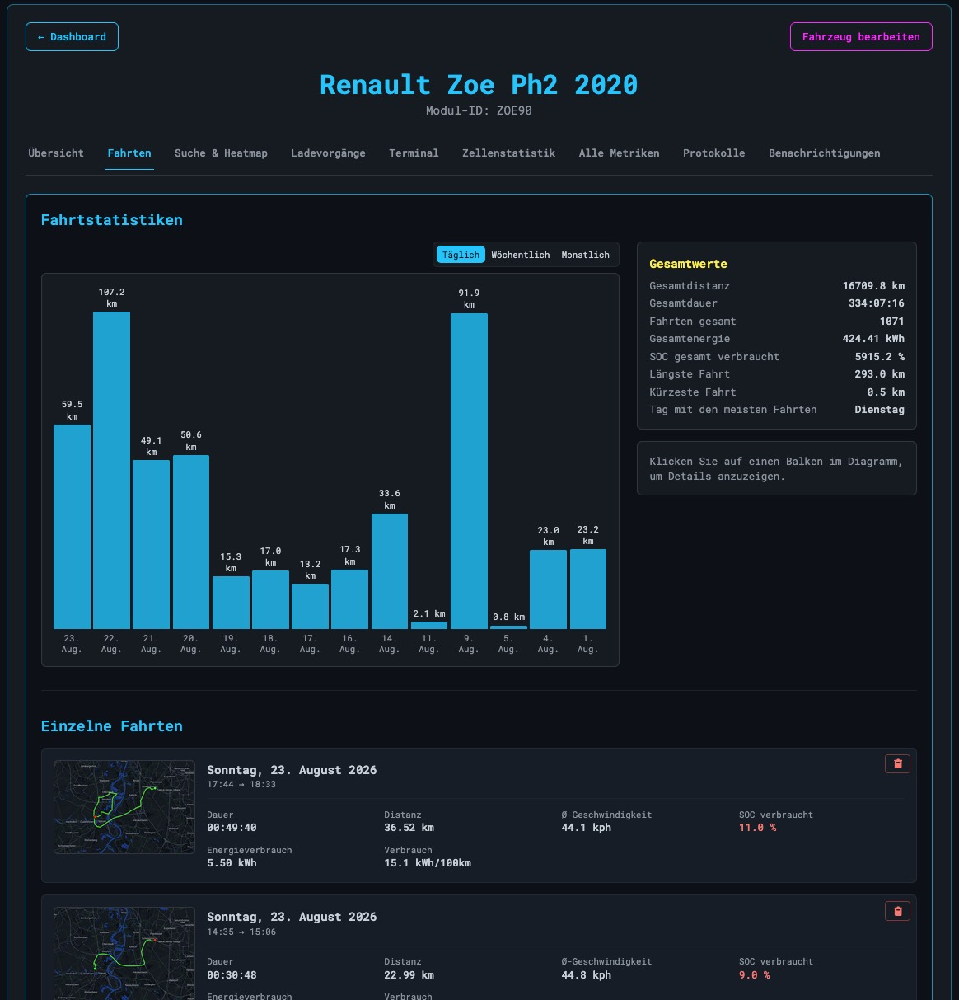
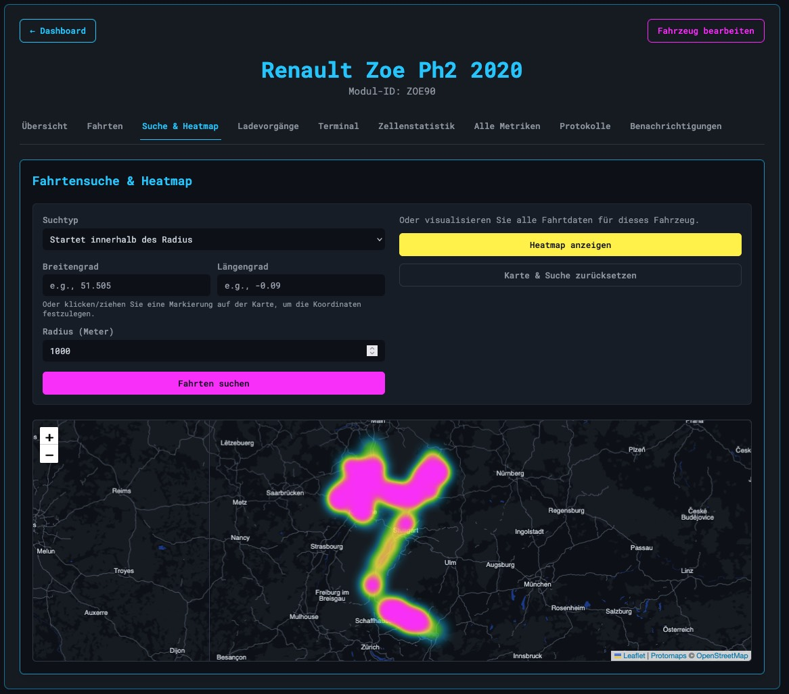
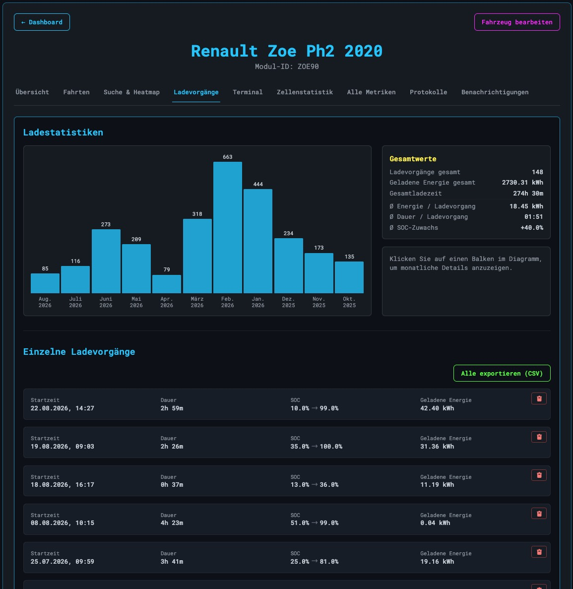
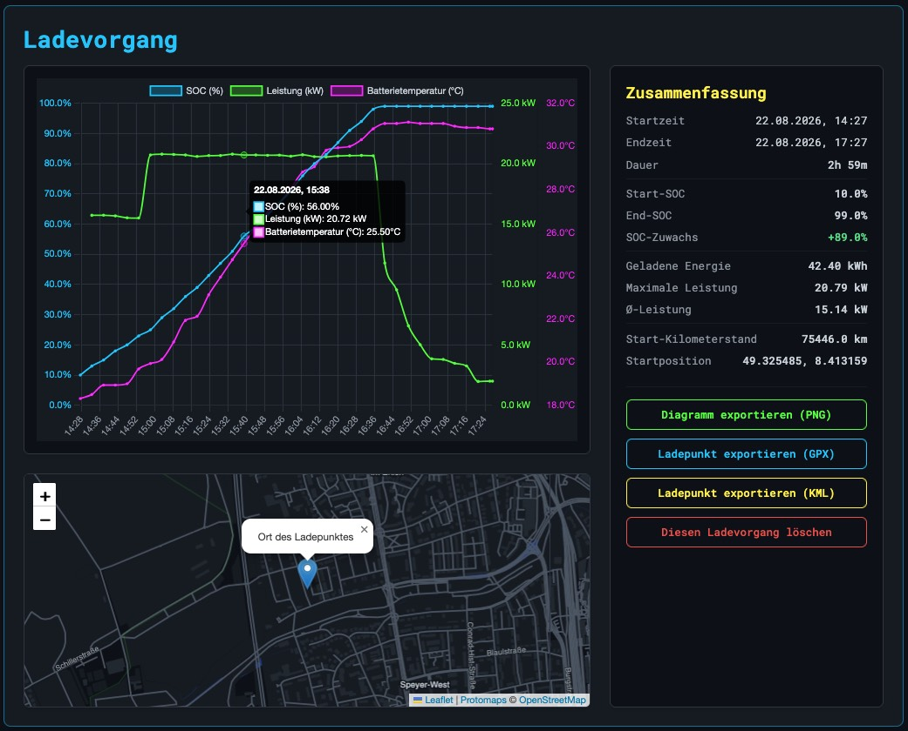
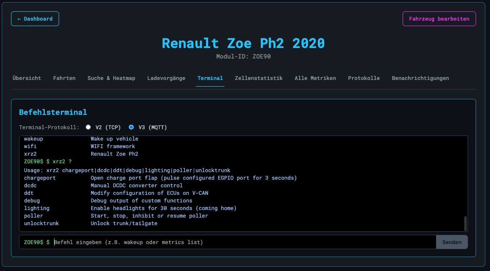
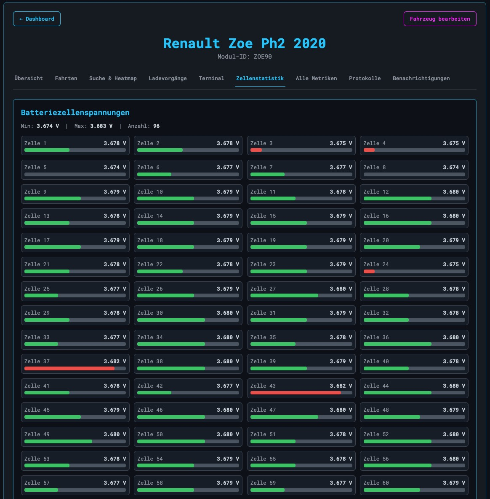
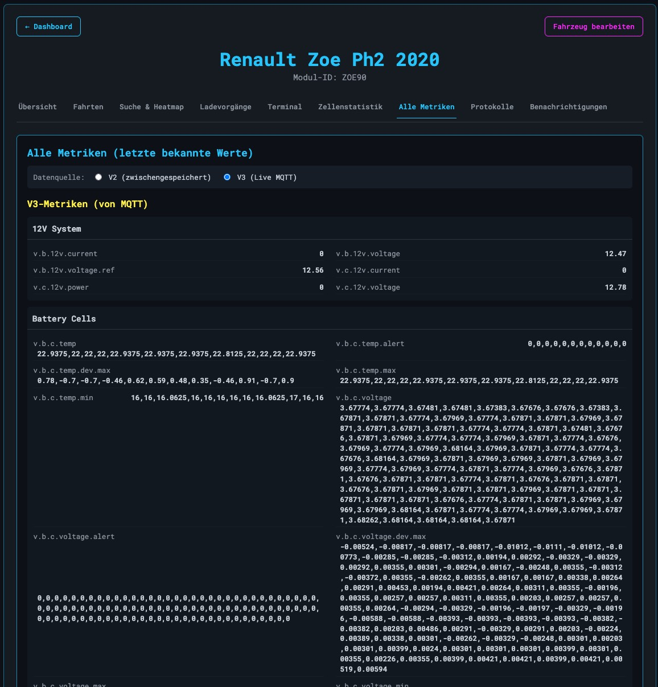
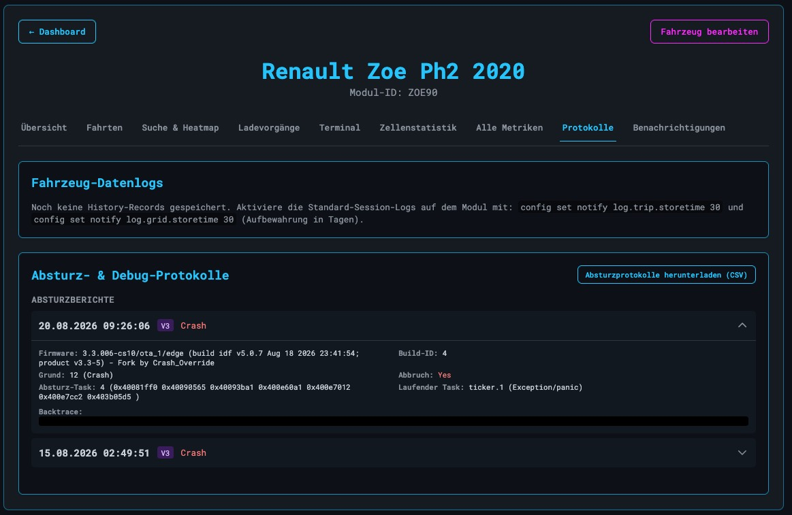
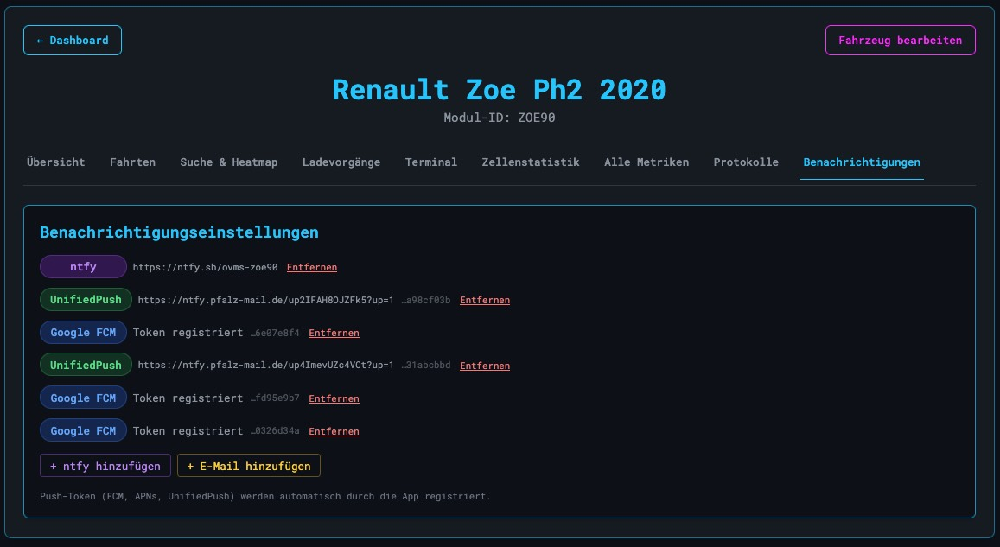

# Vehicle Detail Page

← Back to the [Documentation Map](../Readme.md#documentation-map)

The vehicle detail page is where a single connected vehicle is monitored and controlled. Everything is organized into tabs, each focused on one category of data or interaction:

| Tab | Shows | Requires |
|---|---|---|
| [Overview](#overview) | Connection state, live key metrics, TPMS, map | — |
| [Trips](#trips) | Trip statistics and individual trip list | Karto + `enable_trip_tracking` |
| [Search & Heatmap](#search--heatmap) | Geographic trip search and heatmap | Karto + `enable_trip_tracking` |
| [Charges](#charges) | Charge statistics and session list | `enable_charge_logging` |
| [Terminal](#terminal) | Command line to the module | — |
| [Cell Stats](#cell-stats) | Per-cell voltages and temperatures | V3 (MQTT) cell data |
| [All Metrics](#all-metrics) | Raw metric feed | — |
| [Logs](#logs) | Data logs, crash and debug reports | — |
| [Notifications](#notifications) | Push and email recipients | — |

Tabs that depend on an optional service only appear when that service is enabled — both globally in `.env` and per vehicle on the *Edit Vehicle* page. The screenshots below are taken with the German UI locale; the interface is translated, the tab names in this document are the English ones.

> New here? [Adding a Vehicle](add_vehicle.md) walks through the three-step wizard that registers a module with this server.

---

## Overview



The default landing page for a vehicle. All values update live over the WebSocket connection — no page reload needed.

**Connection** — the two protocols are tracked independently, so a module can be online via one and offline via the other:

- **V2 (TCP) Online** — Yes/No, plus the timestamp of the last TCP message
- **V3 (MQTT) Online** — Yes/No, plus the timestamp of the last MQTT message

A vehicle that reports through both protocols shows `Online (V2+V3)` on the dashboard and gives you redundancy: if the TCP connection drops, metrics keep flowing over MQTT.

**Key Metrics** — the values most people look at first:

- State of Charge (SOC) and estimated range
- 12V auxiliary battery voltage — the classic early warning for a car that will not wake up
- HV battery voltage, battery current, and State of Health (SOH)
- Line voltage and charge current (both `0` when not plugged in)
- Charge state (`stopped`, `charging`, `done`, …) and charge mode (`Standard`, `Range`, …)
- Last known GPS position as decimal degrees

**Tire Pressure & Temperature (TPMS)** — one card per wheel (FR, FL, RR, RL) with a bar for the pressure and the measured temperature next to it. Only shown when the module reports TPMS data.

**Map** — a Leaflet map with the last reported position. Tiles come from [Protomaps](https://protomaps.com/) if you host them yourself, so no location data leaves your server.

---

## Trips



*Requires the optional [Karto](CONFIGURATION.md#karto-trip-tracking) trip tracking service, plus `enable_trip_tracking` on the vehicle.*

**Trip Statistics** — a bar chart of distance driven, switchable between **Daily**, **Weekly** and **Monthly**. Clicking a bar drills into that period. Next to it, the lifetime totals:

- Total distance, total duration, total number of trips
- Total energy and total SOC consumed
- Longest and shortest trip
- Busiest day of the week

**Individual Trips** — a paginated list, newest first. Every entry has a thumbnail map of the route plus duration, distance, average speed, SOC used, energy used, and consumption in kWh/100 km. Trips can be deleted individually with the trash button; the confirmation dialog shows start time and distance so you delete the one you meant to.

---

## Search & Heatmap



*Requires Karto, same as the Trips tab.*

**Trip Search** — find trips geographically rather than by date. Pick a search type:

- *Starts within radius* / *Ends within radius* — a center point plus a radius in meters
- *Starts within bounding box* / *Ends within bounding box* — a rectangle

Coordinates can be typed in, or set by clicking and dragging a marker on the map (for a box, click the two opposite corners). Results are paginated and show the distance from the search point.

**Heatmap** — *Show Heatmap* renders every stored GPS point for the vehicle as a density overlay. It is the fastest way to see where a car actually spends its time; the example above shows a commute corridor plus two clusters of regular activity. *Clear Map & Search* resets both the overlay and the search form.

---

## Charges



*Requires [charge logging](CONFIGURATION.md#charge-logging) enabled on the vehicle. Works with both V2 and V3 vehicles.*

**Charge Statistics** — monthly energy charged as a bar chart, with lifetime totals beside it:

- Total sessions, total energy charged, total time spent charging
- Average energy, average duration, and average SOC gained per session

Clicking a bar opens the detail for that month.

**Individual Charge Sessions** — every logged session with start time, duration, the SOC transition (`10.0% → 99.0%`) and the energy added. *Export All (CSV)* downloads the full history for spreadsheet analysis; individual sessions can be deleted.

### Charge session detail



Clicking a session opens its full record — this is where the charge logger earns its keep.

**The chart** plots three series against time on separate axes: **SOC (%)**, **power (kW)**, and **battery temperature (°C)**. Hovering any point shows all three values at that moment. The shape tells the story: constant power up to roughly 80% SOC, then the taper as the BMS throttles, with pack temperature climbing throughout and levelling off once power drops.

**Summary** lists start/end time, duration, start and end SOC with the gain, energy charged, maximum and average power, the odometer reading at the start, and the start position.

**Map** shows where the session took place — useful for telling a home charge apart from a public one.

**Exports:** the chart as **PNG**, or the charging location as **GPX** or **KML** for import into mapping tools.

---

## Terminal



A direct command line to the OVMS module. The protocol is selectable per session:

- **V2 (TCP)** — fully bi-directional. Commands are sent and the module's response is printed back into the terminal.
- **V3 (MQTT)** — the command is published to the vehicle's topic. Responses arrive over MQTT and are shown as they come in.

The prompt is the module ID (`ZOE90$` above). `?` on its own lists the available commands, and any command followed by `?` prints its usage — the screenshot shows the vehicle-specific `xrz2` command tree of a Renault Zoe Ph2. Common entries: `wakeup` to bring a sleeping module back, `metrics list` to dump every metric, `stat` for charge status.

Previously sent commands can be recalled from the history and re-executed. If the vehicle is offline on the selected protocol, the input is disabled and says so.

**Favorites.** Type a command and press the **★** next to *Send* to keep it under a short label. Favorites appear as buttons below the input; one click sends the command on the selected protocol (the buttons are disabled while the vehicle is offline there), and × removes one. They belong to your account, not to the vehicle, so the same set shows up in every vehicle's terminal and on every device you log in from. Up to 50 can be kept.

**Output height.** Drag the handle between the output and the input line to make the output taller or shorter; the height is remembered by the browser. Double-click the handle to return to the default.

---

## Cell Stats



*Requires V3 (MQTT) cell data. The tab is disabled when the module does not publish it.*

Cell-level data for the traction battery, in two sections:

- **Battery Cell Voltages** — minimum, maximum and cell count in the header, then one card per cell with its voltage and a bar scaled to the pack's own min/max spread. Cells at the extremes of that spread are drawn in red, so an outlier is visible at a glance without reading numbers.
- **Battery Cell Temperatures** — the same layout for the temperature sensors, with the sensor count in the header.

Because the bars are scaled to the actual spread and not to an absolute range, a healthy pack looks busy — in the example the entire 96-cell pack sits between 3.674 V and 3.683 V, a 9 mV spread. What matters is a cell that stays at one end across many readings, which is how imbalance and early degradation show up.

---

## All Metrics



A live, unfiltered dump of every metric the server holds for the vehicle, grouped by subsystem (12V System, Battery Cells, Charging, Location, …).

**Data Source** switches between:

- **V3 (Live MQTT)** — what the module is publishing right now, straight from the broker
- **V2 (Cached)** — the last values received over TCP, from the server-side cache

Names are the raw OVMS metric paths (`v.b.12v.voltage`, `v.b.c.voltage`, …) and array metrics are printed in full, so per-cell arrays appear here as long comma-separated lists.

This tab is a diagnostic and developer tool: use it to confirm a metric is actually being published, to find the exact name for a home automation flow or a custom integration, or to check whether a value is stale before chasing a problem elsewhere.

---

## Logs



Two independent log sources on one tab.

**Vehicle Data Logs** — history records the module sends as data notifications: trip logs, grid/charge session logs, and anything else the firmware records. They are delivered reliably, including across LTE outages, which makes them a more trustworthy record than live metrics. A summary table lists each record type with its count and first/last timestamp, and *Open Data Log Browser* opens the full paginated browser with CSV export.

Most modules need these logs switched on first. The tab prints the exact commands:

```
config set notify log.trip.storetime 30
config set notify log.grid.storetime 30
```

(the number is the retention in days).

**Crash & Debug Logs** — crash reports from the module, tagged **V2** or **V3** depending on which protocol delivered them. Each expands to show:

- Firmware version and build ID at the time of the crash
- Crash reason (numeric code plus text) and whether it was an abort
- The crashing task and the task that was running (`ticker.1 (Exception/panic)` in the example)
- The backtrace, for feeding into an addr2line-style analysis

*Download Crash Logs (CSV)* exports everything for offline review or for attaching to a firmware bug report.

---

## Notifications



Per-vehicle notification recipients. Each row is one target, with a badge for its channel and a *Remove* link.

Two kinds of targets live here:

**Added manually** with the buttons at the bottom:

- **ntfy** — an [ntfy](https://ntfy.sh/) topic URL, either the public server or your own. Optional authentication: none, Bearer token, Basic auth, or a query parameter.
- **Email** — a plain address. Mail goes through the server's outbound queue, so the button is disabled if no SMTP server is configured globally.

**Registered automatically** by the OVMS Connect app when it signs in — you do not add these by hand:

- **Google FCM** — Android push
- **APNs** — iOS push
- **UnifiedPush** — the open push standard, typically pointing at your own ntfy or NextPush endpoint

Push targets are shown with a truncated device token so you can tell devices apart and revoke a single one. Every target is stored per device, and each vehicle is capped at 50 subscriptions — the oldest are evicted beyond that.

Notifications from the vehicle are fanned out to all configured targets at once, rate limited per vehicle so a module firing three messages for one event does not turn into three separate alerts on every device.
